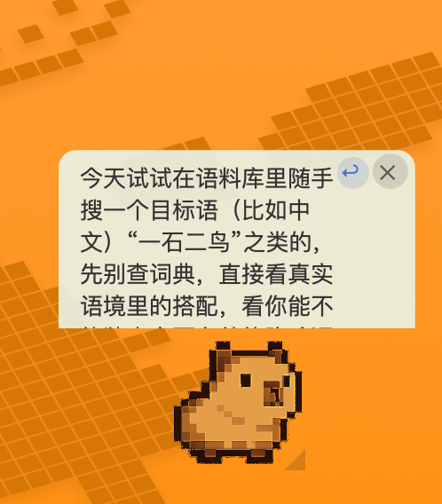
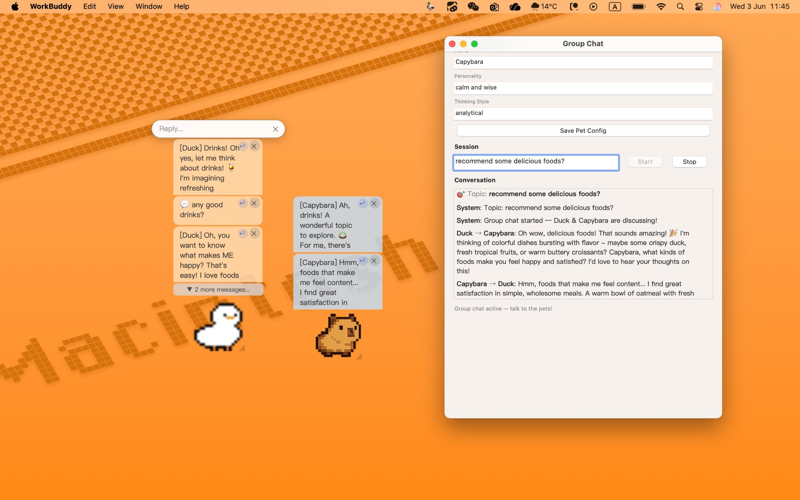
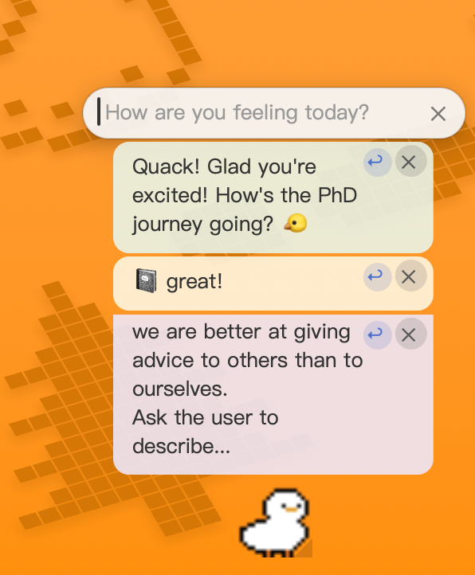
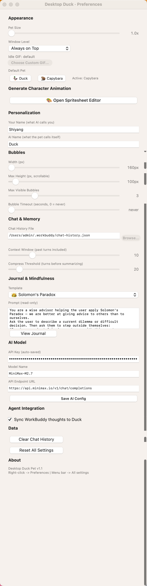
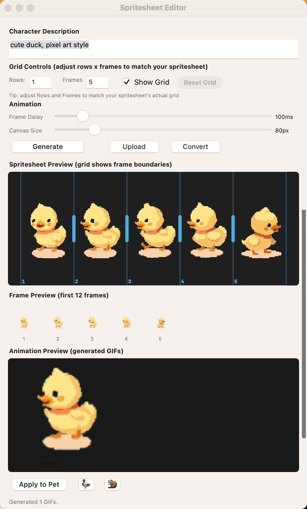
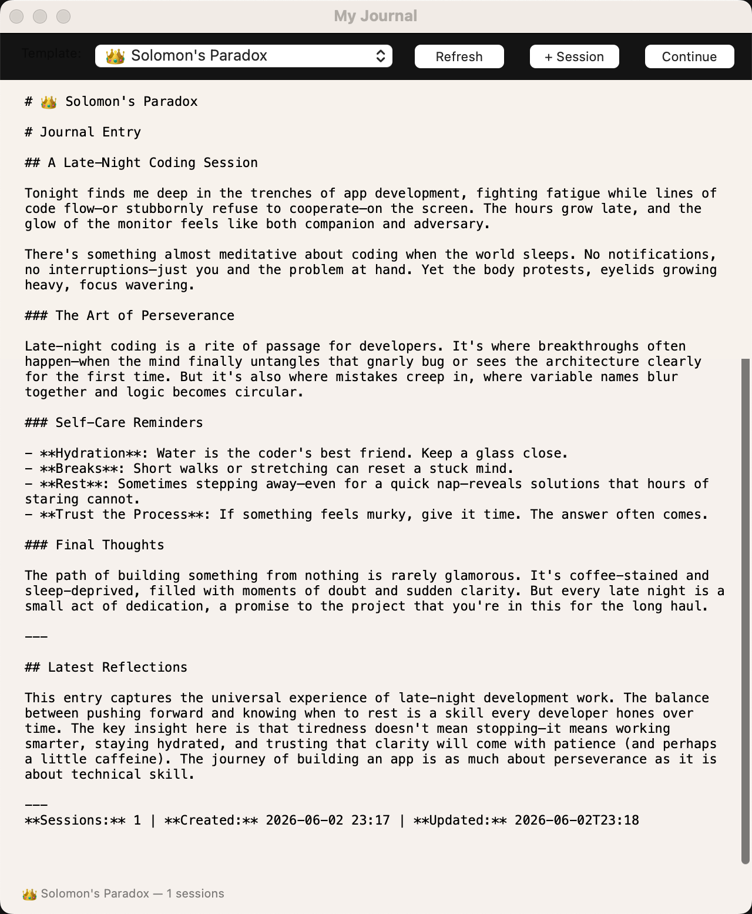

# Desktop Duck 🦆

A desktop pet app for macOS — a floating window with an AI-powered duck (or capybara!) that chats, journals, animates, and now: runs group discussions with a buddy.



## 🆕 v1.2 — Group Chat



Two pets, one stage. From the menu bar, open **Group Chat**, configure both pets' personalities, and start a topic:

- **Dual Pets**: Duck and Capybara appear side by side for every session
- **Autonomous Multi-Turn Discussion**: You speak → pets discuss among themselves (2-3 rounds) → then respond to you
- **Color-Coded Bubbles**: Duck (warm cream), Capybara (ice blue), User (pure white)
- **Hover Glow**: Mouse over any bubble for a subtle highlight effect
- **Collapsible Stacks**: Multiple messages auto-fold; click to expand
- **Full Transcript**: Conversation log with bold speaker names and proper spacing
- **AI Session Summary**: Stop the session and receive an AI-generated discussion summary

## Features

- **Desktop Pet**: Floating animated character (duck or capybara) with idle/walk animations
- **AI Chat**: Powered by MiniMax API — click the duck to chat, right-click for preferences
- **Group Chat** 🆕: Dual-pet autonomous discussions with multi-turn pet-to-pet dialogue (v1.2)
- **Journal**: Iterative document-based journal with AI summarization
- **Character Generator**: AI-powered spritesheet → GIF animation pipeline — describe any character and get a custom animated pet in 6 frames
- **Spritesheet Editor**: Upload/Generate → Grid adjustment → Convert → Apply
- **Preferences**: Full customization of appearance, bubbles, memory, and more

## Screenshots

### Group Chat (v1.2)


### Chat with AI


### Preferences


### AI Character Generator
Describe any character — pixel cat, robot, slime — and the AI generates a full spritesheet with 6 sequential animation poses (idle/walking/thinking/happy/sleepy/surprised), automatically sliced into per-frame GIFs with transparent backgrounds. Fine-tune frame boundaries by dragging grid lines directly on the preview, then convert and apply to your pet with one click.



### Journal


## Quick Start

### Homebrew (recommended)

```bash
brew tap shiyangzheng/tap
brew install --cask desktop-duck
```

### Manual Install

```bash
# Compile the Swift app
swiftc -o duck-pet duck-pet.swift -framework AppKit -framework Foundation

# Bundle into an .app
mkdir -p 小鸭子.app/Contents/MacOS
mkdir -p 小鸭子.app/Contents/Resources
cp duck-pet 小鸭子.app/Contents/MacOS/
cp pet-*.py 小鸭子.app/Contents/Resources/
cp duck-idle.gif capybara.gif 小鸭子.app/Contents/Resources/

# Open it
open 小鸭子.app
```

## Configuration

Copy `duck-config.json.template` to `~/.workbuddy/duck-config.json` and fill in:

```json
{
  "llmApiKey": "your-minimax-api-key",
  "llmModel": "MiniMax-M2.7",
  "minimax_api_key": "your-minimax-api-key"
}
```

For group chat, the config also supports:
```json
{
  "groupChatEnabled": true,
  "groupPets": [
    {"name": "Duck", "personality": "cheerful and energetic", "thinking": "optimistic"},
    {"name": "Capybara", "personality": "calm and wise", "thinking": "analytical"}
  ]
}
```

## Requirements

- macOS 12+
- Swift 5.9+
- Python 3 with Pillow (`pip install Pillow`)
- MiniMax API key for AI features

## Project Structure

- `duck-pet.swift` — Main Swift application
- `pet-group-chat.py` — 🆕 Group chat AI orchestration engine (v1.2)
- `pet-auto-reply.py` — AI chat response engine
- `pet-think.py` — Thought injection bridge
- `pet-generate-character.py` — AI spritesheet generation
- `pet-convert-spritesheet.py` — Spritesheet → GIF conversion
- `pet-journal-summary.py` — Journal AI summarization
- `pet-random-content.py` — Random content/events
- `duck-idle.gif` — Default duck animation
- `capybara.gif` — Capybara alternative pet
- `group_chat.jpg` — 🆕 Group chat screenshot (v1.2)

## Platform

This is a native macOS application built with Swift and AppKit. **Windows is not currently supported** — the app relies on macOS-specific frameworks (NSWindow, AppKit, CGWindow, NSStatusBar, etc.). A cross-platform rewrite would require a different UI framework.

## License

MIT
